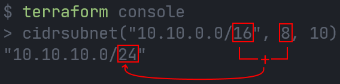
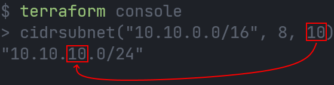
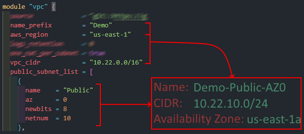

# AWS VPC Terraform Module

Terraform Module to deploy a VPC.

The module accepts a lists of public and private subnets, which are specified with the `public_subnet_list` and `private_subnet_list` parameters, respectively. Each subnet in the list is defined with a name, availability zone (AZ), CIDR range, and network number. This CIDR is built using the `cidrsubnet` function (more details below).

## Conditionals deployment for multiple VPC deployment scenarios:

- **NAT Gateway**: The variable `nat_gateway_settings` can be set to avoid deploying a NAT Gateway, deploy one NAT Gateway for the entire VPC, or deploy one NAT Gateway per private subnet.
    - Default: One NAT Gateway for the entire VPC
- **DHCP Options**: The variable `custom_dhcp_options` can be set to deploy a custom DHCP Options set or use the default DHCP Options set.
    - Default: Use the default DHCP Options set.
- **VPC Flow Logs**: The variable `vpc_flow_logs` can be set to deploy VPC Flow Logs to CloudWatch, S3, or not deploy VPC Flow Logs at all.
    - Default: Not enable VPC Flow Logs.
- **Subnets**: The variable `public_subnet_list` and `private_subnet_list` can be set to deploy public and private subnets, only public subnets, only private subnets, or no subnets at all.
    - Default: Empty lists for both variables, meaning no subnets will be deployed.
    - IMPORTANT: If you are not public subnets also no NAT Gateway will be deployed even if the `nat_gateway_settings.enabled` variable is set to `true`.

> :information_source: More details about each variable can be found in the **variables.tf** file.

### This module have been tested with the following configurations:

- Multiple public and private subnets.
- No Public Subnets.
- No Private Subnets.
- No subnets.
- No NAT Gateway.
- One NAT Gateway.
- One NAT Gatway per Subnet/AZ.
- Custom DHCP Options.
- No custom DHCP Options.
- No VPC Flow Logs.
- VPC Flow Logs with destination CloudWatch.
- VPC Flow Logs with destinition S3.

## How-To use this module:

The following is an example of how to use the module, here the minimum input variables are set directly in the module's resource block, but a better practice would be to declare the variables in a variables.tf file and have the values of the variables in a .tfvars file.

```bash
module "vpc" {
  source                    = "git::https://github.com/JManzur/aws-vpc.git?ref=v1.1.1"
  name_prefix               = "Demo"
  vpc_cidr                  = "10.22.0.0/16"
  public_subnet_list = [
    {
      name    = "Public"
      az      = 0
      newbits = 8
      netnum  = 10
    },
    {
      name    = "Public"
      az      = 1
      newbits = 8
      netnum  = 11
    }
  ]
  private_subnet_list = [
    {
      name    = "Private"
      az      = 0
      newbits = 8
      netnum  = 20
    },
    {
      name    = "Private"
      az      = 1
      newbits = 8
      netnum  = 21
    }
  ]
}
```

## `cidrsubnet` function explanation:

`cidrsubnet` calculates a subnet address within a given IP network address prefix.

```hcl
cidrsubnet(prefix, newbits, netnum)
```

- The `cidrsubnet` function required the following inputs:
  - `prefix`: The VPC CIDR block in 0.0.0.0/0 format.
    - **Example**: 10.22.0.0/16
  - `newbits`:  The number of bits to be added to the netmask.
    - **Example**: If prefix netmask=16, and  newbits=8, then 16+8=24
    - 
  - `netnum`: The number to be added in the third octet of the CIDR block.
    - **Example**: If prefix=10.22.0.0 and netnum=10, then 10.22.0.0 becomes 10.22.10.0
    - 

### Full example of the resulting CIDR, naming, and AZ assignment:



<!-- BEGINNING OF PRE-COMMIT-TERRAFORM DOCS HOOK -->
## Requirements

| Name | Version |
|------|---------|
| <a name="requirement_terraform"></a> [terraform](#requirement\_terraform) | >= 1.0 |
| <a name="requirement_aws"></a> [aws](#requirement\_aws) | >= 5.0.0 |

## Providers

| Name | Version |
|------|---------|
| <a name="provider_aws"></a> [aws](#provider\_aws) | 5.27.0 |

## Modules

No modules.

## Resources

| Name | Type |
|------|------|
| [aws_cloudwatch_log_group.vpc_log_group](https://registry.terraform.io/providers/hashicorp/aws/latest/docs/resources/cloudwatch_log_group) | resource |
| [aws_default_route_table.public](https://registry.terraform.io/providers/hashicorp/aws/latest/docs/resources/default_route_table) | resource |
| [aws_eip.nat_gateway](https://registry.terraform.io/providers/hashicorp/aws/latest/docs/resources/eip) | resource |
| [aws_flow_log.cloudwatch](https://registry.terraform.io/providers/hashicorp/aws/latest/docs/resources/flow_log) | resource |
| [aws_flow_log.s3](https://registry.terraform.io/providers/hashicorp/aws/latest/docs/resources/flow_log) | resource |
| [aws_iam_policy.vpc_flow_logs](https://registry.terraform.io/providers/hashicorp/aws/latest/docs/resources/iam_policy) | resource |
| [aws_iam_role.vpc_flow_logs](https://registry.terraform.io/providers/hashicorp/aws/latest/docs/resources/iam_role) | resource |
| [aws_iam_role_policy_attachment.vpc_flow_logs](https://registry.terraform.io/providers/hashicorp/aws/latest/docs/resources/iam_role_policy_attachment) | resource |
| [aws_internet_gateway.this](https://registry.terraform.io/providers/hashicorp/aws/latest/docs/resources/internet_gateway) | resource |
| [aws_nat_gateway.this](https://registry.terraform.io/providers/hashicorp/aws/latest/docs/resources/nat_gateway) | resource |
| [aws_route_table.private](https://registry.terraform.io/providers/hashicorp/aws/latest/docs/resources/route_table) | resource |
| [aws_route_table_association.private_multi_natgw](https://registry.terraform.io/providers/hashicorp/aws/latest/docs/resources/route_table_association) | resource |
| [aws_route_table_association.private_one_nat_gw](https://registry.terraform.io/providers/hashicorp/aws/latest/docs/resources/route_table_association) | resource |
| [aws_s3_bucket.vpc_flow_logs](https://registry.terraform.io/providers/hashicorp/aws/latest/docs/resources/s3_bucket) | resource |
| [aws_s3_bucket_lifecycle_configuration.vpc_flow_logs](https://registry.terraform.io/providers/hashicorp/aws/latest/docs/resources/s3_bucket_lifecycle_configuration) | resource |
| [aws_s3_bucket_public_access_block.vpc_flow_logs](https://registry.terraform.io/providers/hashicorp/aws/latest/docs/resources/s3_bucket_public_access_block) | resource |
| [aws_s3_bucket_server_side_encryption_configuration.vpc_flow_logs](https://registry.terraform.io/providers/hashicorp/aws/latest/docs/resources/s3_bucket_server_side_encryption_configuration) | resource |
| [aws_s3_bucket_versioning.vpc_flow_logs](https://registry.terraform.io/providers/hashicorp/aws/latest/docs/resources/s3_bucket_versioning) | resource |
| [aws_subnet.private](https://registry.terraform.io/providers/hashicorp/aws/latest/docs/resources/subnet) | resource |
| [aws_subnet.public](https://registry.terraform.io/providers/hashicorp/aws/latest/docs/resources/subnet) | resource |
| [aws_vpc.this](https://registry.terraform.io/providers/hashicorp/aws/latest/docs/resources/vpc) | resource |
| [aws_vpc_dhcp_options.this](https://registry.terraform.io/providers/hashicorp/aws/latest/docs/resources/vpc_dhcp_options) | resource |
| [aws_vpc_dhcp_options_association.this](https://registry.terraform.io/providers/hashicorp/aws/latest/docs/resources/vpc_dhcp_options_association) | resource |
| [aws_availability_zones.available](https://registry.terraform.io/providers/hashicorp/aws/latest/docs/data-sources/availability_zones) | data source |
| [aws_caller_identity.current](https://registry.terraform.io/providers/hashicorp/aws/latest/docs/data-sources/caller_identity) | data source |
| [aws_iam_policy_document.cloudwatch](https://registry.terraform.io/providers/hashicorp/aws/latest/docs/data-sources/iam_policy_document) | data source |
| [aws_iam_policy_document.s3](https://registry.terraform.io/providers/hashicorp/aws/latest/docs/data-sources/iam_policy_document) | data source |
| [aws_iam_policy_document.vpc_flow_logs](https://registry.terraform.io/providers/hashicorp/aws/latest/docs/data-sources/iam_policy_document) | data source |
| [aws_region.current](https://registry.terraform.io/providers/hashicorp/aws/latest/docs/data-sources/region) | data source |

## Inputs

| Name | Description | Type | Default | Required |
|------|-------------|------|---------|:--------:|
| <a name="input_custom_dhcp_options"></a> [custom\_dhcp\_options](#input\_custom\_dhcp\_options) | [OPTIONAL] Values to create a custom DHCP options set | <pre>object({<br>    enabled              = bool<br>    domain_name          = optional(string)<br>    domain_name_servers  = optional(list(string))<br>    ntp_servers          = optional(list(string))<br>    netbios_name_servers = optional(list(string))<br>    netbios_node_type    = optional(number)<br>  })</pre> | <pre>{<br>  "domain_name": null,<br>  "domain_name_servers": null,<br>  "enabled": false,<br>  "netbios_name_servers": null,<br>  "netbios_node_type": null,<br>  "ntp_servers": null<br>}</pre> | no |
| <a name="input_force_bucket_destroy"></a> [force\_bucket\_destroy](#input\_force\_bucket\_destroy) | [OPTIONAL] A boolean that indicates all objects should be deleted from the bucket so that the bucket can be destroyed without error. These objects are not recoverable. | `bool` | `false` | no |
| <a name="input_name_prefix"></a> [name\_prefix](#input\_name\_prefix) | [REQUIRED] Prefix to use in VPC resource naming and tagging | `string` | n/a | yes |
| <a name="input_nat_gateway_settings"></a> [nat\_gateway\_settings](#input\_nat\_gateway\_settings) | [OPTIONAL] Allows the conditional creation of NAT Gateways, and the number of NAT Gateways to create | <pre>object({<br>    enabled        = bool           # If true, it will create NAT Gateways, if false, it will not create NAT Gateways<br>    one_per_subnet = optional(bool) # If true, it will create one NAT Gateway per subnet, if false, it will create one NAT Gateway per VPC<br>  })</pre> | <pre>{<br>  "enabled": true,<br>  "one_per_subnet": false<br>}</pre> | no |
| <a name="input_private_subnet_list"></a> [private\_subnet\_list](#input\_private\_subnet\_list) | [REQUIRED] List of key value maps to build the CIDR using the cidrsubnets function, plus the value name and index number for the availability zone | <pre>list(object({<br>    name    = string<br>    az      = number<br>    newbits = number<br>    netnum  = number<br>  }))</pre> | `[]` | no |
| <a name="input_public_subnet_list"></a> [public\_subnet\_list](#input\_public\_subnet\_list) | [REQUIRED] List of key value maps to build the CIDR using the cidrsubnets function, plus the value name and index number for the availability zone | <pre>list(object({<br>    name    = string<br>    az      = number<br>    newbits = number<br>    netnum  = number<br>  }))</pre> | `[]` | no |
| <a name="input_vpc_cidr"></a> [vpc\_cidr](#input\_vpc\_cidr) | [REQUIRED] The VPC CIDR block, Required format: '0.0.0.0/0' | `string` | n/a | yes |
| <a name="input_vpc_flow_logs"></a> [vpc\_flow\_logs](#input\_vpc\_flow\_logs) | [OPTIONAL] The configuration of the VPC Flow Logs | <pre>object({<br>    enabled              = bool<br>    destination          = optional(string)<br>    aggregation_interval = optional(number)<br>    logs_retention       = optional(number)<br>  })</pre> | <pre>{<br>  "aggregation_interval": null,<br>  "destination": null,<br>  "enabled": false,<br>  "logs_retention": 0<br>}</pre> | no |

## Outputs

| Name | Description |
|------|-------------|
| <a name="output_private_subnets_ids"></a> [private\_subnets\_ids](#output\_private\_subnets\_ids) | The Private Subnets ID |
| <a name="output_public_subnets_ids"></a> [public\_subnets\_ids](#output\_public\_subnets\_ids) | The Public Subnets ID |
| <a name="output_vpc_cidr"></a> [vpc\_cidr](#output\_vpc\_cidr) | The VPC CIDR Block |
| <a name="output_vpc_id"></a> [vpc\_id](#output\_vpc\_id) | The VPC ID |

## Author:

- [@JManzur](https://jmanzur.com)
<!-- END OF PRE-COMMIT-TERRAFORM DOCS HOOK -->
